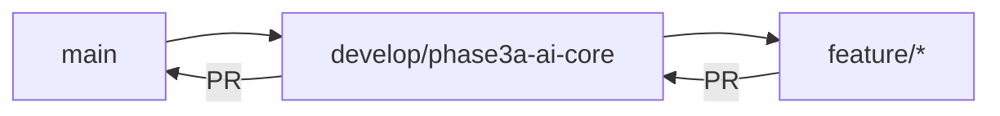

# 🌿 Phase 3A Branch Structure

> **GitFlow-based branching strategy for Phase 3 AI-Native Architecture implementation**

---

## Branch Hierarchy

```
main (production)
│
└── develop/phase3a-ai-core (integration)
    │
    ├── feature/maol-intent-router (active)
    ├── feature/maol-task-planner (planned)
    └── feature/neural-tracking-system (planned)
```

## Branch Descriptions

### `main` 
- **Purpose**: Stable production code
- **Protection**: Full branch protection enabled
- **Merge Strategy**: Squash merge only via PR

### `develop/phase3a-ai-core`
- **Purpose**: Integration branch for Phase 3A AI Core features
- **Base for**: All feature branches
- **Protection**: Standard protection

### Feature Branches

| Branch | Purpose | Status | Priority |
|--------|---------|--------|----------|
| `feature/maol-intent-router` | Multi-modal intent classification | 🔴 Active | P0 |
| `feature/maol-task-planner` | Chain-of-thought task decomposition | 🟡 Planned | P1 |
| `feature/neural-tracking-system` | Privacy-first behavior tracking | 🟡 Planned | P1 |

## Workflow



### Development Flow

1. **Start New Feature**
   ```bash
   git checkout develop/phase3a-ai-core
   git pull origin develop/phase3a-ai-core
   git checkout -b feature/your-feature-name
   ```

2. **Develop & Commit**
   ```bash
   # Make changes...
   git add .
   git commit -m "feat: description of change"
   ```

3. **Push & Create PR**
   ```bash
   git push origin feature/your-feature-name
   # Create PR on GitHub: develop/phase3a-ai-core ← feature/your-feature-name
   ```

4. **Review & Merge**
   - PR requires at least 1 approval
   - CI checks must pass
   - Squash merge to develop

5. **Release to Main**
   - PR from develop → main
   - Additional review required
   - Deploy after merge

## Naming Conventions

### Branch Names
- `feature/description` - New features
- `fix/description` - Bug fixes
- `hotfix/description` - Urgent production fixes
- `docs/description` - Documentation only

### Commit Messages
Follow [Conventional Commits](https://www.conventionalcommits.org/):
- `feat:` New feature
- `fix:` Bug fix
- `docs:` Documentation changes
- `style:` Code formatting
- `refactor:` Code refactoring
- `test:` Adding tests
- `chore:` Maintenance tasks

## Protection Rules

### Main Branch
- ✅ No direct pushes allowed
- ✅ PR required with 1+ approval
- ✅ CI checks must pass
- ✅ Squash merge enforced

### Develop Branches
- ⚠️ Direct pushes allowed for maintainers
- ✅ PR recommended for collaboration
- ✅ Fast-forward merges acceptable

### Feature Branches
- ✅ No restrictions
- ✅ Force push allowed (rebase workflow)

---

**Last Updated**: 2026-01-24  
**Phase**: 3A - AI Core Implementation  
**Strategy**: GitFlow Modified
