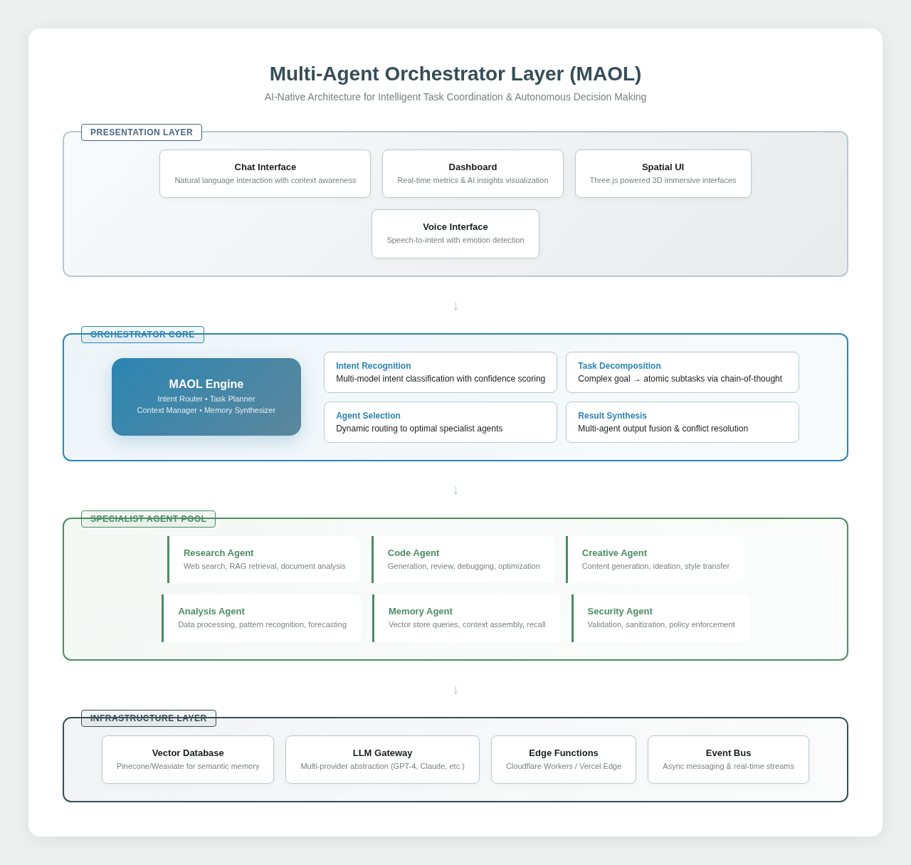
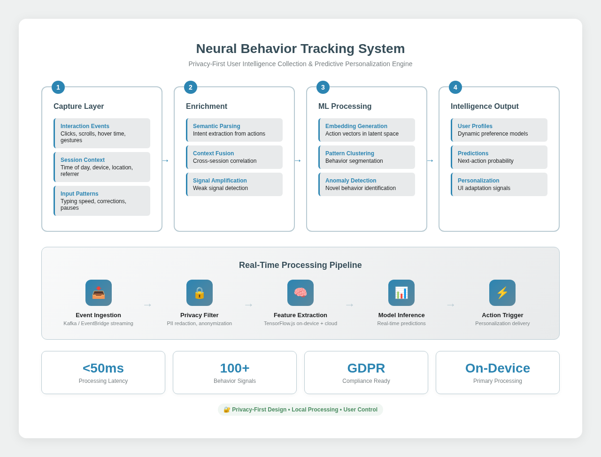
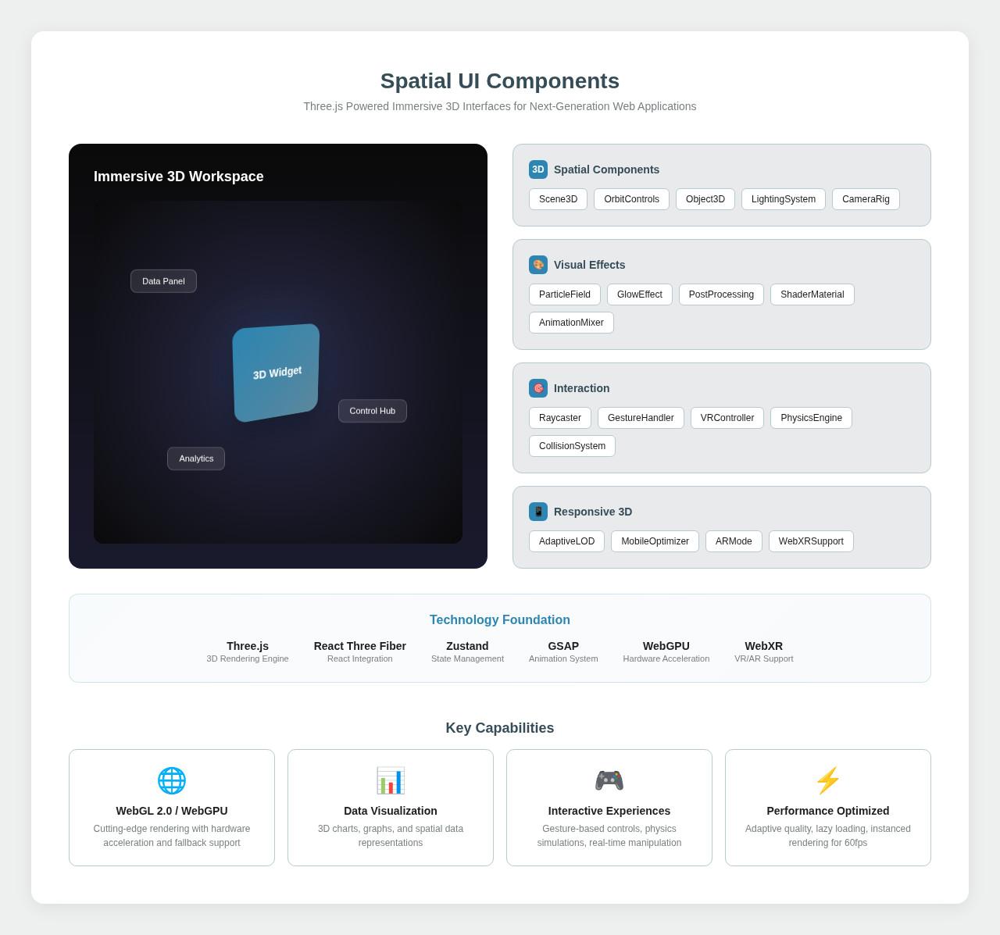
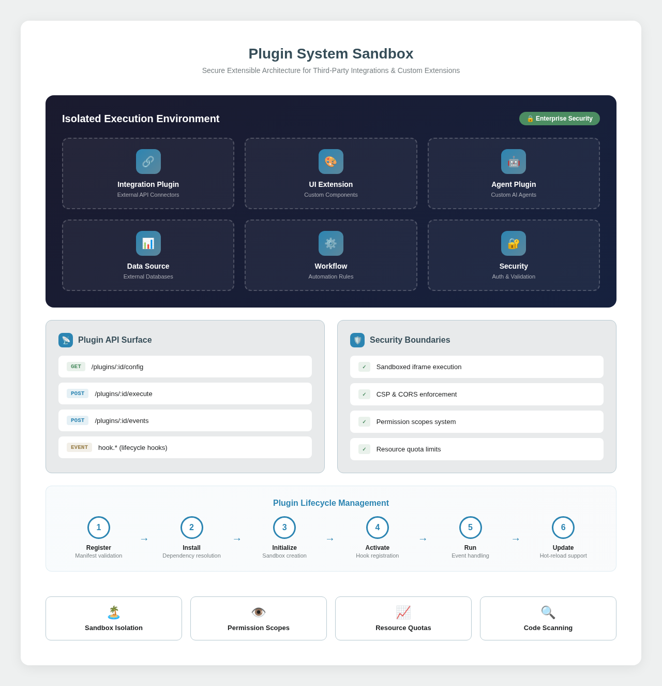
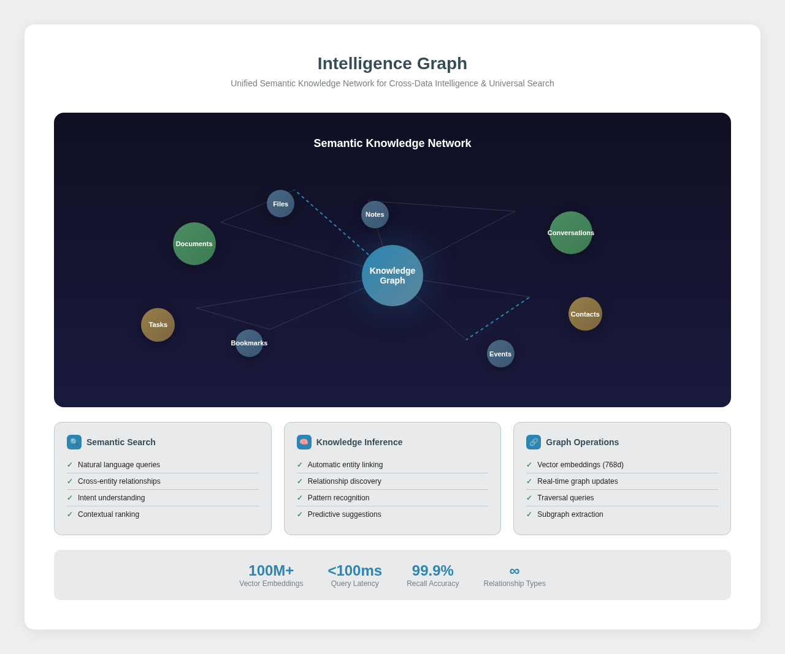
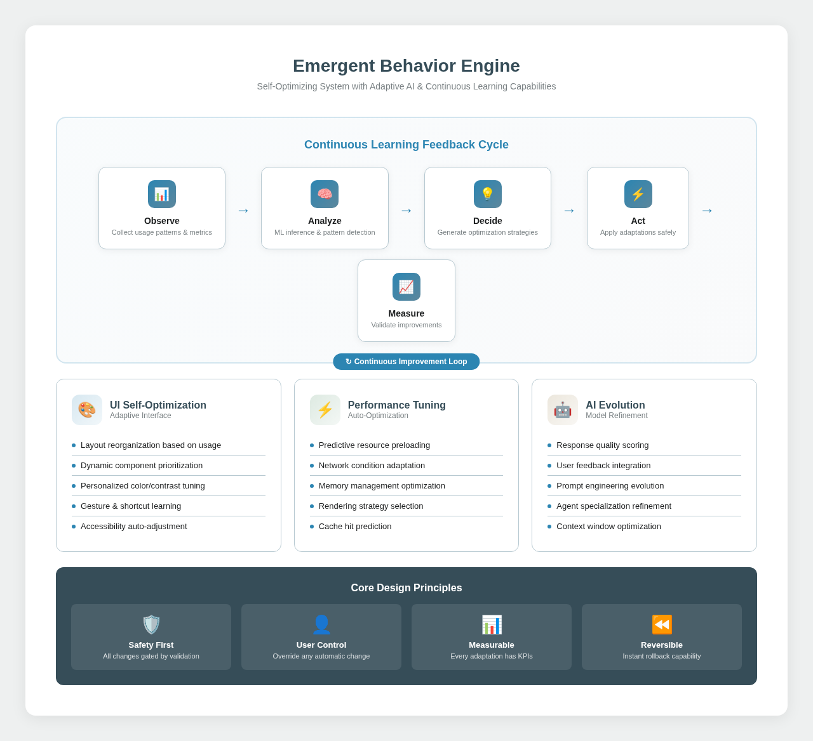

# Phase 3: AI-Native Architecture (Public Demo)

## ✨ Welcome to the Future

This repository showcases our **AI-native architecture** implementation - where artificial intelligence isn't just a feature, it's the foundation.

## 🏗️ Architecture Overview

Our Phase 3 architecture introduces **6 revolutionary pillars** that transform how applications think, learn, and evolve:

### 🧠 The 6 Pillars

| # | Component | Purpose | Status |
|---|-----------|---------|--------|
| 1 | **MAOL** | Multi-Agent orchestration & coordination | 🚀 Phase 3A |
| 2 | **Neural Tracking** | Privacy-first behavior intelligence | 🔄 Phase 3B |
| 3 | **Spatial UI** | Immersive 3D interfaces | ⏳ Phase 3C |
| 4 | **Plugin Sandbox** | Secure extensibility | ⏳ Phase 3C |
| 5 | **Intelligence Graph** | Semantic knowledge network | 🔄 Phase 3B |
| 6 | **Emergent Engine** | Self-optimization | ⏳ Phase 3C |

## 📸 Architecture Diagrams

### 1. MAOL (Multi-Agent Orchestrator Layer)


The brain of our AI system - coordinating multiple specialized agents to handle complex user intents.

### 2. Neural Behavior Tracking


Understanding user behavior without compromising privacy - all processing happens on-device.

### 3. Spatial UI Components


Breaking free from flat interfaces - true 3D spatial computing experiences.

### 4. Plugin System Sandbox


Extensibility without compromise - secure, isolated, powerful plugin architecture.

### 5. Intelligence Graph


Connecting knowledge semantically - not just storing information, understanding relationships.

### 6. Emergent Behavior Engine


Systems that improve themselves - continuous autonomous optimization.

## 🚀 Quick Start

```bash
# Clone this repository
git clone https://github.com/testdemoqwenai2025-creator/Demo3SciMSPT.git

# Explore the architecture diagrams
open docs/phase3/diagrams/

# Read the full proposal
open docs/phase3/Phase3_AI_Native_Architecture_Proposal.pdf
```

## 📁 Repository Structure

```
Demo3SciMSPT/
├── docs/
│   └── phase3/
│       ├── README.md                    # You are here
│       ├── Phase3_*.pdf                 # Complete white paper
│       └── diagrams/                    # 6 high-resolution architecture diagrams
│           ├── 01-maol-architecture.png
│           ├── 02-neural-tracking.png
│           ├── 03-spatial-ui.png
│           ├── 04-plugin-system.png
│           ├── 05-intelligence-graph.png
│           └── 06-emergent-behavior.png
├── src/                                # Coming in Phase 3A
└── README.md
```

## 🎯 Current Focus: Phase 3A

We're currently implementing the **MAOL (Multi-Agent Orchestrator Layer)**:

### Active Development Branches:
- `feature/maol-intent-router` - Core intent classification
- `feature/maol-task-planner` - Task decomposition engine  
- `feature/neural-tracking-system` - Behavioral intelligence
- `develop/phase3a-ai-core` - Integration branch

### What We're Building:

#### Intent Router
```
User Input → NLP Analysis → Intent Classification → Agent Selection → Response
```

#### Task Planner
```
Complex Request → Subtask Identification → Dependency Mapping → Execution Plan → Results
```

## 🌟 Key Innovations

### 1. AI-First Design
Every feature starts with "How can AI enhance this?" rather than "Can we add AI to this?"

### 2. Privacy by Design
Neural tracking processes everything locally - zero raw data leaves the device.

### 3. Self-Evolving Architecture
The Emergent Behavior Engine enables continuous improvement without manual updates.

### 4. Spatial Computing Ready
Built for the next generation of 3D, immersive interfaces.

## 📊 Tech Stack

| Technology | Use Case |
|------------|----------|
| **TensorFlow.js** | On-device ML inference |
| **Three.js / WebGPU** | Spatial UI rendering |
| **Vector Database** | Intelligence Graph storage |
| **WebAssembly** | High-performance plugin sandbox |
| **React Server Components** | Hybrid rendering |

## 🔗 Links

- **Private Development Repo**: [SciMSPT3](https://github.com/testdemoqwenai2025-creator/SciMSPT3)
- **Architecture Proposal PDF**: [Download Here](Phase3_AI_Native_Architecture_Proposal.pdf)
- **Issue Tracker**: [GitHub Issues](../../issues)

## 📈 Progress

- [x] Architecture design complete
- [x] Documentation published
- [x] Repository initialization
- [ ] MAOL Intent Router (in progress)
- [ ] Neural Tracking integration
- [ ] Public demo deployment

---

**Built for the future. Designed for intelligence. Optimized for impact.**

*Part of the SciMSPT AI-Native Initiative*
